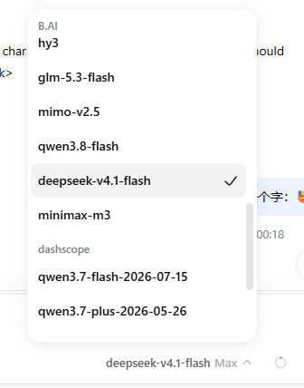
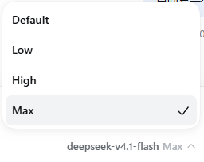

# dsh-model-caps

[English](README.md) · **简体中文**

一个轻量的 [DeepSeek Harness](https://github.com/deepseek-ai/deepseek-harness) 插件。它给**自定义供应商**补上空白的上下文窗口、输出上限、思考等级，以及思考线协议相关的 `compat`，这样在对话里选模型时就和内置供应商一样，并能正确发包——不用再去 `settings.yaml` 里手写这些项。已经写过的值会保留。不会增删模型。

**设计真源：** [DESIGN.zh.md](DESIGN.zh.md)。默认轨是 OpenAI 兼容；Anthropic 由用户自选。一个自定义路由只有一种 `api`。

## 怎么用

装好后，打开对话，像选内置模型一样从自定义供应商里选模型即可。空白的容量和思考字段已经由插件补好。



自定义供应商（上图里的 **B.AI**、**dashscope**）和别的路由排在同一份菜单里。换模型就在这里点；没有单独的设置页。



模型有思考等级表时，底栏会露出档位（Default / Low / High / Max …）。选一档即可；插件自动写入的 `compat` 会按当前 Completions 或 Anthropic 路由去对齐能发出的线协议。

手写的 `compat`、非标准线值、以及 `reasoningEfforts: false` 都不会动。

## 它写什么

自定义供应商是 `llm-pi-ai` 里同时带有 `api`、`baseURL` 和至少一个模型的路由。`openai`、`google` 这种目录路由不动。

每个字段的空白按此顺序合并（见 [DESIGN.zh.md](DESIGN.zh.md) §5）：

1. 供应商自己的 `GET {baseURL}/models`。
2. **pi-ai 内置目录**（宿主里有时）：按规范化 id 匹配，优先同 `api`，否则厂商行；再投影到当前路由协议。可叠加 **maker** 的 Completions `thinkingFormat`；仅有 Anthropic 命中时只补菜单，不伪造 `deepseek` 线。
3. [models.dev](https://models.dev/api.json) 厂商行补剩余空隙（无内置命中时还有薄方言兜底）。

id 查找：精确 → 去掉 `scheme:` / 取路径叶 → 剥日历日期 → 剥后面还有段名的 `vN.M`（`deepseek-v4.1-flash` → `deepseek-v4-flash`；裸 `mimo-v2.5` 不剥）。`FlashX` 与 `Flash` 不互相折叠。

写入：`contextWindow`、`maxTokens`、空白 `name`、空白 `input`（`text` / `image`）、`reasoningEfforts`、自动 `compat`。目录形自动填可刷新。不写路由级思考预算。

## 安装

从 npm 安装，然后重启 `dsh web`：

```bash
dsh plugin --profile web add dsh-model-caps
```

需要 Node 24 或更高版本。挂载时会补一次；之后在设置里保存供应商，也会再补一次。没有单独的设置页。

在本仓库里开发，继续用本地链接，不要用 npm 上的包盖掉它：

```bash
node build-model-caps.mjs
dsh plugin --profile web add ./package
```

## 更新 / 卸载

npm 安装之后：

```bash
dsh plugin --profile web update dsh-model-caps
```

然后重启 `dsh web`。在本仓库里改代码，则重新构建本地链接：

```bash
git pull && node build-model-caps.mjs
```

卸载：`dsh plugin --profile web remove dsh-model-caps`。手写线值和 `compat` 不会被改。只含标准等级名的思考等级可能会被刷新；卸掉插件不会把这次刷新撤回去。

## 发布新版本

```bash
node publish-via-actions.mjs 1.0.1
```

这会在 GitHub 上启动 `publish.yml`，并等到跑完。版本号要比 npm 上的更高。也可以自己打开 Actions 手动跑 `publish.yml`。

第一次使用前，到 npm 这个包的设置里添加 Trusted Publisher：用户 `IQzhan`，仓库 `dsh-model-caps`，工作流文件名 `publish.yml`，并允许直接 `npm publish`。

## 目录结构

| 路径 | 作用 |
| --- | --- |
| `dsh-model-caps-core.js` | 纯策略：索引、匹配、投影、合并、planMutations |
| `dsh-model-caps-sync.js` | IO：listing、models.dev、可选内置目录、mutate |
| `dsh-model-caps.host.js` | Cordis 挂载与触发 |
| `dsh-model-caps.client.js` | 不画设置页 |
| `build-model-caps.mjs` | 构建 `package/` |
| `DESIGN.md` / `DESIGN.zh.md` | 设计真源 |
| `docs/images/` | README 截图 |
| `publish-via-actions.mjs` | 经 Actions 触发并等待 npm 发布 |

## 测试

```bash
node verify.mjs
```

**8 个套件。** 测试临时文件写在仓库内 `.tmp/`。

## 许可

[MIT](LICENSE)
